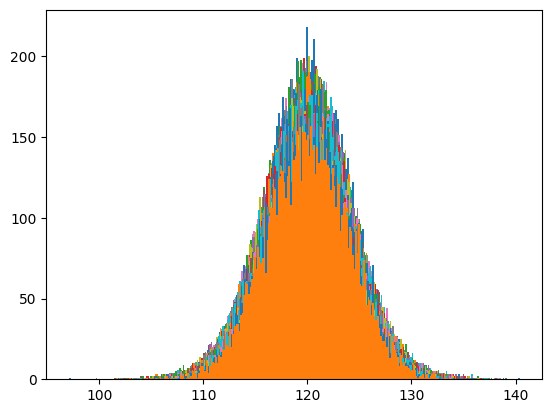
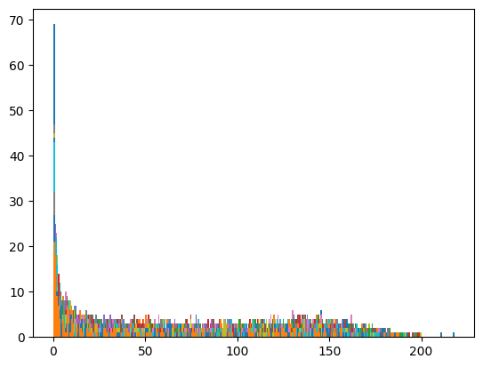
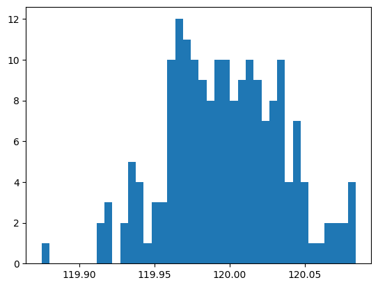
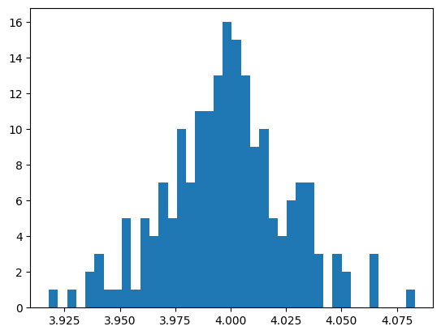
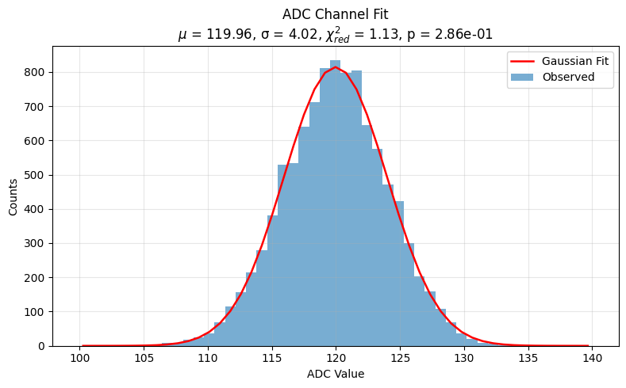

in the next task i have collected all cell's data across all 10k events
stored that in all_cell_adc array

```python
    def cell_ADC( ADC, cell_id, N_events = 10000):
        cell_adc = []
        for event, cell, adc in ADC:
            if cell == cell_id:
            cell_adc.append(adc)
        return cell_adc

    N_cell = 192
    N_events = 10000

    all_cell_adc = []

    for i in range(N_cell):
        all_cell_adc.append(cell_ADC(ADC2, i))
    all_cell_adc = np.array(all_cell_adc)

```

after this
storing all counts and bins of each cell for further processing

```python
    N_bins = 200
    counts = [[] for _ in range(N_bins)]
    bins =  [[] for _ in range(N_bins+1)]

    for i in range(N_cell):
    counts[i], bins[i], _ = plt.hist(all_cell_adc[i], bins = N_bins, density = False)
```


plots of counts of each cell is
```python
    for i in range(N_cell):
        plt.hist(counts[i], bins = N_bins)
```


after this i fit each cell's count with gaussian 
```python
    # calculating the mean and deviaiton of each cell across events after fitting to normal distribution
    from scipy.stats import norm, kstest

    # example: all_cell_adc shape = (n_channels, n_events)
    n_channels, n_events = all_cell_adc.shape

    mu_list = np.zeros(n_channels)
    sigma_list = np.zeros(n_channels)
    ks_pvalues = np.zeros(n_channels)

    for ch in range(n_channels):
        data = all_cell_adc[ch]
        mu_hat, sigma_hat = norm.fit(data)   # MLE for Gaussian
        mu_list[ch] = mu_hat
        sigma_list[ch] = sigma_hat

        # Optional: Kolmogorov-Smirnov test against fitted normal
        # Note: kstest with estimated params is approximate (p-values not exact)
        ks_stat, ks_p = kstest(data, 'norm', args=(mu_hat, sigma_hat))
        ks_pvalues[ch] = ks_p

    # quick summaries
    print("mu mean, std:", np.mean(mu_list), np.std(mu_list))
    print("sigma mean, std:", np.mean(sigma_list), np.std(sigma_list))
    print("fraction channels KS p>0.05:", np.mean(ks_pvalues > 0.05))
```
this gives the mean and sigma distribution of each channel  
MEAN:-
  
SIGMA:- 
  

then i fit each channel with the fitted parameter and computed the chi-square fit
```python
    # Perform Poisson chi-square fit for a single channel
    def fit_poisson_channel(ch, data, min_expected=5):
        N = len(data)
        mu_hat, sigma_hat = mu_list[ch], sigma_list[ch]

        bin_edges = np.linspace(mu_hat - 5 * sigma_hat, mu_hat + 5 * sigma_hat, 50)
        counts, _ = np.histogram(data, bins=bin_edges)
        bin_centers = (bin_edges[:-1] + bin_edges[1:]) / 2

        expected_probs = norm.pdf(bin_centers, mu_hat, sigma_hat)
        expected_probs /= expected_probs.sum()
        expected_counts = expected_probs * N

        obs_counts_merged, exp_counts_merged = merge_low_expected(counts, expected_counts, min_expected=min_expected)
        mask = exp_counts_merged > 0
        chi_square = np.sum((obs_counts_merged[mask] - exp_counts_merged[mask])**2 / exp_counts_merged[mask])

        dof = np.count_nonzero(mask) - 1 - 1
        p_value = chi2.sf(chi_square, dof) if dof > 0 else np.nan

        return {
            "mu_hat": mu_hat,
            "sigma_hat": sigma_hat,
            "chi2": chi_square,
            "p_value": p_value,
            "dof": dof,
            "reduced_chi2": chi_square / dof if dof > 0 else np.nan
        }
```
for channel 1,  


THIS WAS FOR FITTING 
while doing pedestal substraction
we took avg betweeen 1st and 4th quartile
```python
    # Pedestal subtraction per cell
    def pedestal_subtraction(ADC):
        ADC_array = np.array(ADC)  
        
        cells = np.unique(ADC_array[:, 1])
        
        ADC_avg = {}

        # Calculate the mean for 2nd and 3rd quartiles per cell
        for cell in cells:
            cell_adc = ADC_array[ADC_array[:, 1] == cell][:, 2]  
            q1, q3 = np.percentile(cell_adc, [25, 75])
            
            # Select only values in the 2nd and 3rd quartile
            mid_values = cell_adc[(cell_adc >= q1) & (cell_adc <= q3)]
            
            ADC_avg[cell] = np.mean(mid_values)

        # Apply pedestal subtraction
        ADC_subtracted = []
        for event, cell, adc in ADC:
            adc_corr = adc - ADC_avg[cell]
            ADC_subtracted.append([event, cell, adc_corr])
        
        return ADC_subtracted, ADC_avg

```